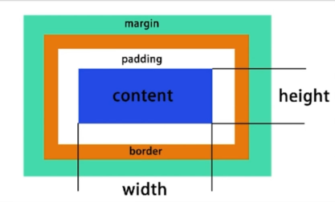

# css布局

## 概述

- 早起以table为主
- 后来以技巧性布局为主
- 现有的flexbox/grid
- 响应式布局 

## 盒子模型

- 宽高 只对 content生效
- 盒子占用的空间= content+padding+border+margin 

> display
- 确定元素的显示类型：
  - block 块级元素
  - inline 行内元素
  - inline-block 行内块级元素（对内有宽高、对外是一个行内元素）

> position
- 确定元素的位置
  - static：静态的位置（按正常文档流）
  - relative:相对位置（相对元素本身位置偏移，不会改变占据的空间）
  - obsolute:绝对位置（脱离文档流的独立的存在，不影响其他元素 ，相对于最近的父级（absolute、relative）元素或者body ）
  - fixed：规定位置（脱离文档流，不对其他元素布局造成影响，相对于屏幕）

- z-index:设置为 relative、obsolute、fixed的可以设置z-index(显示层级)
## 常用布局方式

### table布局

> table table-row table-row

### float浮动 + margin

[清除浮动](https://segmentfault.com/a/1190000004865198)

- 元素浮动
- 脱离文档流，不对其他元素的布局造成影响 
- 不脱离文本流

> float 对自身的影响

- 使得自身形成快(BFC),可以设置宽高
- 位置尽量靠上
- 位置尽量靠左(右)

> 对兄弟的影响
- 上面贴非float元素
- 旁边贴float元素
- 不影响其他块级元素的位置
- 影响其他块级元素内部的文本 

>  对父级元素的影响
- 从布局上消失，对父级元素来说相当于不存在
- 父元素高度塌陷(因为消失了)
  - 解决方式(清除浮动)：  
  - overflow:auto，父级元素适应浮动元素
  - 用其他元素把高度撑起来(具体见html)

### inline-block 布局

> 定宽的情况比较适合

- 像文本一样排block元素
- 没有清除浮动问题
- 需要处理间隙

### felxbox 布局

- 弹性盒子
- 盒子本来就是并列的、指定宽度即可 

> display: flex;
            
### 响应式设计

- 不同设备锁正常使用
- 主要处理屏幕大小问题
- 主要方法：
  - 隐藏
  - 折行
  - 自适应空间
- 方式
  - rem(字号大小，按比例放大；精确度高的不用rem)
  - viewport
  - media query（两份样式）

